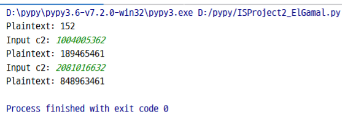

# 📕 Introduction

**[Report](https://github.com/Lin-CX/information-security-final-project/blob/main/ISProject2_2017320215.docx?raw=true) of this project.**

### 🎈 Use known information to decrypt two encryptions as below:

1. **RSA**
2. **ElGamal**

#### 📖 RSA

* About [RSA](https://en.wikipedia.org/wiki/RSA_(cryptosystem))
* Code: **[ISProject2_RSA.c](https://github.com/Lin-CX/information-security-final-project/blob/main/ISProject2_RSA.c)**, [**ISProject2_RSA.py**](https://github.com/Lin-CX/information-security-final-project/blob/main/ISProject2_RSA.py)

* Known info:

  * n: 9943237852845877651 (64 bits)

  * e: 13 (receiver’s public key)
  * Ciphertext C = 1220703125

* `find_pq()` function takes a lot of time, I used C instead of Python to implemented this step. Other parts are run on Python.
* The value of **n** is too big, I used `typedef unsigned long long int ULLI` type parameters.

##### Result

* PR = {d, n} = {9178373396735665477, 9943237852845877651}

* p: 2701212721  q: 3681027331

* M: 5

#### 📖 ElGamal

* About [ElGamal](https://en.wikipedia.org/wiki/ElGamal_encryption)
* Code: **[ISProject2_ElGamal.py](https://github.com/Lin-CX/information-security-final-project/blob/main/ISProject2_ElGamal.py)**
* Known info:
  * q: 2934201397 (GF(2934201397)-32 bits)
  * a: 37 (primitive root of q)
  * YA: 2174919958 (receiver’s public key)
  * Ciphertext c:(c1= 2909170161, c2= 2565161545)
* Using [Pypy](https://en.wikipedia.org/wiki/PyPy) instead of Python to run faster.

##### Result

